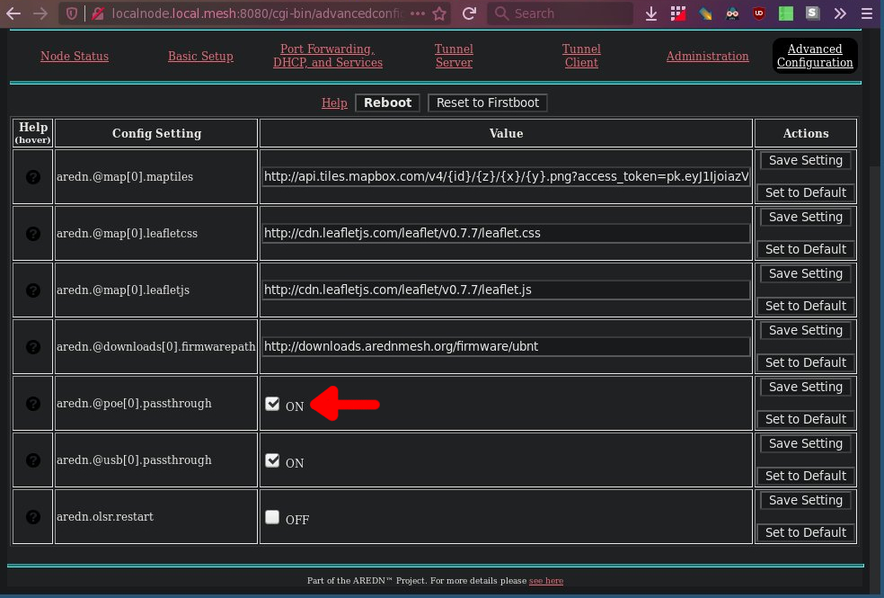
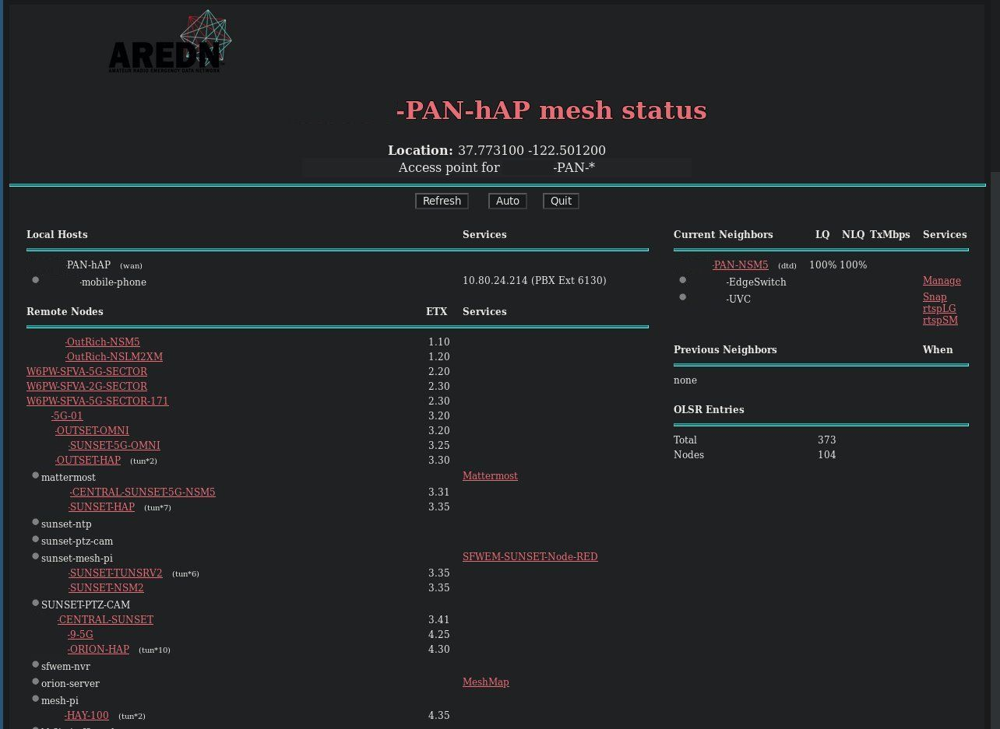
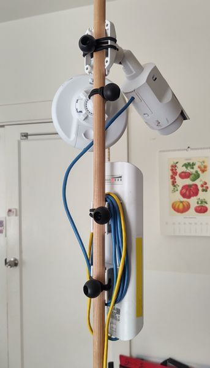
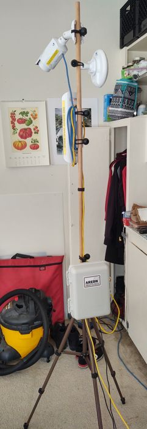
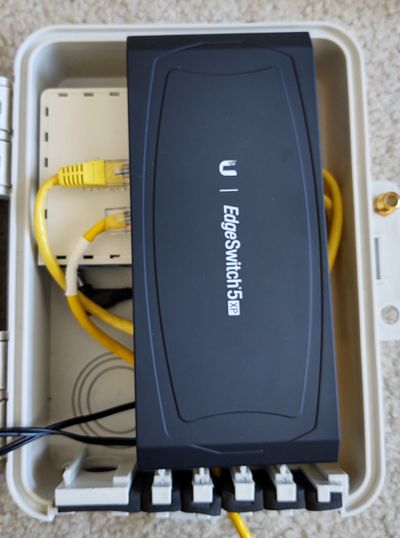
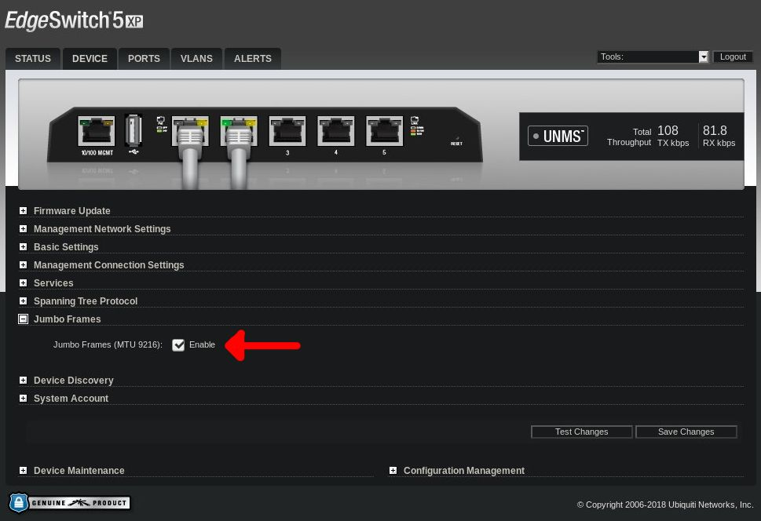

# PAN-hAP v2
#### A capable portable AREDN mesh node and how to build it!
---

Radio gear (and the hAP) must be flashed with AREDN firmware to use on the
AREDN network.  Please read the [AREDN docs][0] to familiarize yourself with
mesh requirements and procedures.

[0]: https://arednmesh.readthedocs.io/en/stable/index.html

### Bill of Materials

|                              | Radio Gear                                 | Price       | Purchase     | Required?     |
| :---:                        | :---                                       | :---:       | :---         | :---          |
| ![MikroTik hAP][HAP]         | [Mikrotik hAP AC Lite][1]                  | $50         | [Amazon][6]  | Required (operator access point)
| ![NSM5 Front][NSM5]          | [Nanostation Master 5][2] (NSM5)           | $80         | [Amazon][7]  | Radio 1: Required (your main entry into the mesh)
| ![NBM5][NBM5]                | [Nanobeam 5 (16 dbi)][3]  (NBM5)           | $65         | [Amazon][8]  | Radio 2: Optional
| ![G3 Flex][G3Flex]           | [Unifi G3 Flex (or similar)][4]            | $100 - $200 | [Amazon][9]  | Optional, but useful
| ![EdgeSwitch 5XP][ES]        | [EdgeSwitch 5XP][5]                        | $95         | [Amazon][10] | Optional (required if using more than a couple devices)
|                              | Ethernet cable (3-6ft each)                |             |              | Required (obviously)
|                              |                                            |             |              |               |
|                              | **Power Gear**                             | **Price**   | **Purchase** | **Required?** |
| ![Battery][Batt]             | [Lithium (LiFePO4, LFP) battery, 9Ah+][11] | $35         | [Amazon][13] | Required
| ![DC Boost Converter][Boost] | 12V->24V boost converter                   | $10         | [Amazon][14] | Required
| ![Power Meter][Meter]        | [In-line power meter][12]                  | $15         | [Amazon][15] | Optional
|                              |                                            |             |              |               |
|                              | **Hardware**                               | **Price**   | **Purchase** | **Required?** |
| ![Tripod][Tripod]            | Amazon Basics light stand                  | $17         | [Amazon][16] | Required (or similar)
| ![Box][Box]                  | 9x6x3 waterproof storage box               | $19         | [Amazon][17] | Required (will be deployed outdoors)
| ![Bungee][Bungee]            | bungee cord loops, zip ties, velcro ties   | $15         | [Amazon][18] | Required (holding everything to the mast)

[HAP]:    img/hap.jpg
[NSM5]:   img/nsm5.jpg
[NBM5]:   img/nbm.jpg
[G3Flex]: img/uvc_camera.jpg
[ES]:     img/edgeswitch.jpg

[Batt]:   img/batt.jpg
[Boost]:  img/dc_boost_converter.jpg
[Meter]:  img/power_meter.jpg

[Tripod]: img/tripod.jpg
[Box]:    img/box.jpg
[Bungee]: img/bungee.jpg

[1]:  https://mikrotik.com/product/RB952Ui-5ac2nD
[2]:  https://www.ui.com/airmax/nanostationm/
[3]:  https://www.ui.com/airmax/nanobeamm/
[4]:  https://store.ui.com/collections/unifi-protect-cameras/products/unifi-video-g3-flex-camera
[5]:  https://www.ui.com/edgemax/edgeswitch-xp/
[6]:  https://www.amazon.com/gp/product/B019PCF3QY
[7]:  https://www.amazon.com/dp/product/B00HXT8KJ4
[8]:  https://www.amazon.com/dp/product/B00N9ZIEJC
[9]:  https://www.amazon.com/dp/product/B07TVFKLJP
[10]: https://www.amazon.com/gp/product/B07FZK1MKB

[11]: https://www.bioennopower.com/collections/12v-series-lifepo4-batteries/products/copy-of-12v-12ah-lfp-battery-pvc-blf-1212w
[12]: https://powerwerx.com/watt-meter-analyzer-inline-dc-powerpole
[13]: https://www.amazon.com/dp/product/B016LE7QJ6
[14]: https://www.amazon.com/gp/product/B01EFUHFW6
[15]: https://www.amazon.com/dp/product/B088KTMQNB

[16]: https://www.amazon.com/gp/product/B07NRYJZ9V
[17]: https://www.amazon.com/gp/product/B07FY224LW
[18]: https://www.amazon.com/gp/product/B07YWBCKQD

### PAN v2

This is version two of my portable AREDN node. It started as a rough copy and
inspiration from Kiley's original mesh presentation to the SFARC. It was easy
to build with simple consumer items, but it left much to be desired:

- Physical stability - the tripod was top-heavy and wobbly
- Tools - tightening bolts and pipe clamps required more force than bare
  fingers can apply
- Power - full-spec USB-C PD supplies are hard to weed out from junk, and 20V
  doesn't cut it for certain gear
- DC inputs - splitting power off to two devices makes for a lot of wire in the
  case, and I can feed it with one line into the switch to feed all other
  devices over PoE (with some limitations)

My goals:
- Access point for station operator with IP phone line
- Strategic fill-in node to facilitate nodes further downstream
- Provide audio/video feed for tactical awareness

Some useful improvements:
- VHF/UHF radio and digital interface - DMR/P25 hotspot?
- Solar power
- Larger batteries

## Putting It Together

Order of assembly will be:
1. Power supply chain - make sure the supply voltage is correct before powering
   devices
2. Test radio hardware - to make sure all the devices are communicating locally
   and with a distant node
3. Assemble the box as a whole package
4. Set up tripod, attach everything to the mast

### Power Supply

Required parts:
- 12V LFP battery pack
- 12V->24V DC-DC boost converter
- One barrel plug (and wires)

Any type of 12V battery will suffice, but depending on how much power is drawn,
one may need a larger capacity to run the node for any substantial length of
time. Using this chain as an example, I need to deliver 14W to run at full
power. This includes an NSM5, NBM5, UVC (with IR LEDs running), powered switch,
hAP and boost converter. From my 12V LFP pack, this draws just over 1A (14W).
With a decent-size pack (12Ah), this chain can run for just under 12 hours;
that's plenty of time to run a one-day event.

Before hooking up any hardware to the power supply, ensure the boost converter
is putting out the full 24V, and make sure the input is on the right wires!
Ensure the negative terminal wires are not crossed, as they are not common.

### Testing Radio Hardware

At this point we will test all the hardware to make sure it all communicates
well. The easiest way to start is with the hAP. The hAP takes a wide range of
voltage input, so if you accidentally put the trigger into the wrong mode, it
won't ruin anything (unless polarity is reversed, of course). Plug in the hAP
and its lights should start blinking. Using your phone or computer, check for
the hAP's wifi access point. Once it appears, the hAP is fully booted and ready
to log into. To run radios downstream from the hAP, Power Over Ethernet
passthrough must be enabled in the hAP's advanced configuration.

So now you have the hAP powered up and PoE passthrough enabled, and the device
has been rebooted. Connect the NSM5 (or preferred radio) into the hAP's port
5. This is important because the hAP only supports PoE output on port 5, and
port 5 is configured in the firmware for device-to-device (DtD) traffic.
Make sure the device has powered up and check its status page. You should be
able to get into this device just by following links from the hAP's status
page.

At this point, try aiming your radio at a nearby node and retrieving the mesh
status. You should see a status page like this one from the hAP:

Notice the `(dtd)` label on the NSM5; this means the two devices are connected
over ethernet. There are other entries in that list that will be covered later.

Have a camera? Now's the time to enable PoE passthrough on the NSM5 and plug
the camera into the secondary ethernet port. This will be about the most you
can plug into the hAP's PoE port; the hAP outputs a maximum of 500 mA. The NSM5
pulls 8W max and the camera pulls 4-5W, bringing us to ~540 mA draw, which is
close enough to not blow anything up.

With the chain powered up and viewable on your local device, point the NSM at a
nearby node and watch it connect to the larger network. The better the
connection, the faster the status page will populate and the lower the ETX
numbers on distant nodes.

This is a simple node so far without any room to expand with more devices.
Including the EdgeSwitch will enable expansion; this will be covered in more
detail later.

### Mounting

Now everything is up and running and tested, it's time to mount everything in
the box and onto the tripod and mast. For the battery, simply use sticky velcro
strips to secure it to the box lid. The hAP includes mounting screws that fit
into the box's mounting tracks. I put the hAP as high and as far left as I
could to leave room for cables and extra hardware in the future.

`img: Power supply mounted`  
`img: hAP mounted`  

Last will be radios on the mast. I use bungee cord to keep the mount flexible
in height and orientation. Depending on how thick the mast is, bungee cords
could be up to 4 inches long. They should not be loose when mounted. The NSM5
will have no problems in wind, but the camera and NBM5 may. Experiment! This
image includes the NBM5, although it is not hooked up at the moment.

And voila! Final product:

## Additional Hardware

Need another radio, camera or something else that requries PoE? The hAP
won't be able to power another device, so this is where a powered switch like
the EdgeSwitch 5XP comes in. This device does not take PoE input, so it will
need to be powered through the barrel jack.

The EdgeSwitch has per-port PoE output, so you can disable any you don't need
to save some power. To make the connections, I moved the NSM5 from the hAP to
port 2 of the switch (PoE on), then plugged the hAP port 5 into the switch in
port 1 (PoE off). This will maintain any `dtd` link traffic between the hAP and
its connected devices. The box has just enough depth to fit the hAP, switch and
battery stacked. Cables should route under the switch to avoid pinching in the
lid or against the sides. The switch just barely fits the length of my box with
slight modification.

Because the EdgeSwitch is a managed switch, it will handle incoming and
outgoing VLAN tags such as those on the AREDN network. The `dtd` label is a
result of these VLAN tags. On AREDN, VLAN 1 is tagged for WAN, 2 is tagged for
DtD connections, and untagged is treated like a LAN device. For more
information, read about VLAN tagging on the [AREDN website][18]. In the
switch's configuration, enable support for jumbo frames; this will allow the
switch to simply pass tagged VLAN packets along rather than manipulating them.
No other configuration is needed, although the switch does allow per-port VLAN
tagging.

[18]: https://arednmesh.readthedocs.io/en/stable/arednGettingStarted/advanced_config.html#node-vlans
