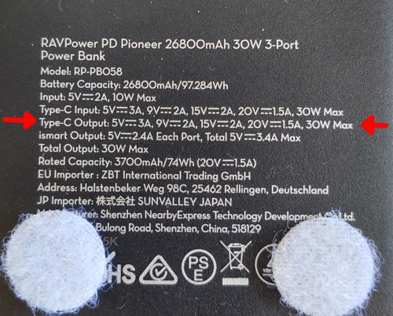
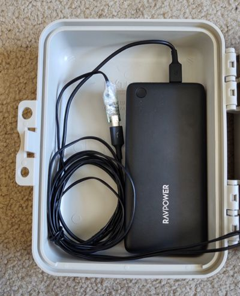
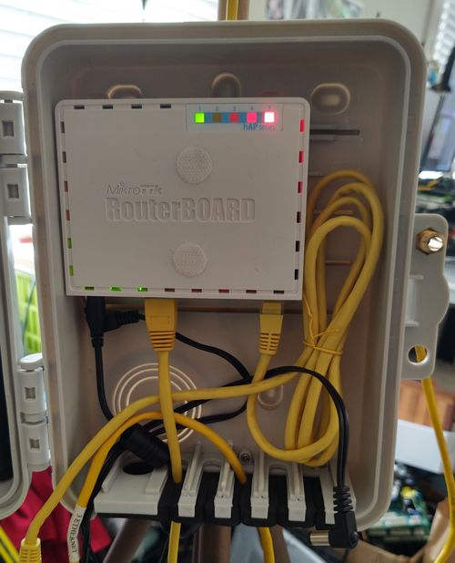
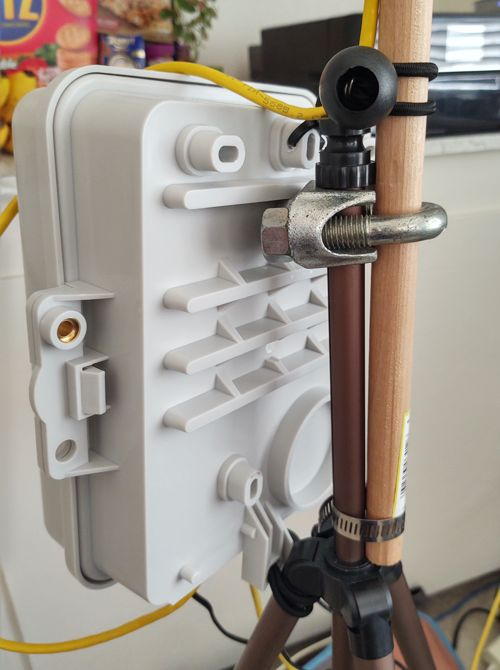

# PAN-hAP
#### A capable portable AREDN mesh node and how to build it!
---

A list of required and optional gear will be listed first with more detail
given as we put it together. Radio gear must be flashed to use on the AREDN
network. Please read the [AREDN docs][0] to familiarize yourself with mesh
requirements and procedures.

[0]: https://arednmesh.readthedocs.io/en/stable/index.html

### Bill of Materials

|       | Radio Gear | Price | Purchase | Required? |
| :---: | :---       | :---: | :---     | :---      |
| ![MikroTik hAP][HAP]  | [Mikrotik hAP AC Lite][1] (HAP)    | $50         | [Amazon][6]  | Required (operator access point)
| ![NSM5 Front][NSM5]   | [Nanostation Master 5][2] (NSM5)   | $80         | [Amazon][7]  | Recommended (or other preferred radio), extra radios optional
| ![NBM5][NBM5]         | [Nanobeam 5 (16 dbi)][3]  (NBM5)   | $65         | [Amazon][8]  | Optional
| ![UVC Camera][UVC]    | [Unifi UVC Camera (or similar)][4] | $100 - $200 | [Amazon][9]  | Optional, but useful
| ![EdgeSwitch 5XP][ES] | [EdgeSwitch 5XP][5]                | $95         | [Amazon][10] | Optional (required if using more than a couple devices)
| | Several pieces of ethernet cable (3-6ft each)            |             |              | Required (obviously)
| | | | | |
| | **Power Gear** | **Price** | **Purchase** | **Required?** |
| ![Battery][Batt]            | Ravpower USB-C PowerDelivery battery    | $35 | [Amazon][11] | Required
| ![PD Trigger][Trigger]      | PD trigger board                        | $10 | [Amazon][12] | Required
| ![Battery Charger][Charger] | PD USB-C charger                        | $15 | [Amazon][13] | Required
| ![Barrel][Barrel]           | barrel-terminated cables (2mm pin size) |     |              | Required
| | | | | |
| | **Hardware** | **Price** | **Purchase** | **Required?** |
|                                    | Amazon Basics camera tripod      | $17   | [Amazon][14]         | Required (or similar)
|                                    | 3/4-inch dowel                   | $2    | Local hardware store | Optional (extended mast)
| ![U-Bolt (image left)][Mount]      | U-bolt (3/4-inch inner diameter) | $2    | Local hardware store | Required for extended mast
| ![Hose Clamp (image right)][Mount] | hose clamp                       | $0.50 | Local hardware store | Required for extended mast
| ![Box][Box]                        | 9x6x3 waterproof storage box     | $19   | [Amazon][15]         | Required (will be deployed outdoors)
|                                    | bungee cord loops (or zip ties)  | $15   | [Amazon][16]         | Required (holding everything to the mast)

[HAP]:     img/hap.jpg
[NSM5]:    img/nsm5.jpg
[NBM5]:    img/nbm.jpg
[UVC]:     img/uvc_camera.jpg
[ES]:      img/edgeswitch.jpg

[Batt]:    img/batt.jpg
[Trigger]: img/pd_trigger_board_front.jpg
[Charger]: img/charger.jpg
[Barrel]:  img/barrel.jpg

[Mount]:   img/mounting_hardware.jpg
[Box]:     img/box.jpg
[Bungee]:  img/bungee.jpg

[1]:  https://mikrotik.com/product/RB952Ui-5ac2nD
[2]:  https://www.ui.com/airmax/nanostationm/
[3]:  https://www.ui.com/airmax/nanobeamm/
[4]:  https://store.ui.com/collections/unifi-protect-cameras/products/unifi-video-camera-g3-bullet
[5]:  https://www.ui.com/edgemax/edgeswitch-xp/
[6]:  https://www.amazon.com/gp/product/B019PCF3QY
[7]:  https://www.amazon.com/dp/product/B00HXT8KJ4
[8]:  https://www.amazon.com/dp/product/B00N9ZIEJC
[9]:  https://www.amazon.com/dp/product/B07TVFKLJP
[10]: https://www.amazon.com/gp/product/B07FZK1MKB

[11]: https://www.amazon.com/gp/product/B01LRQDAEI
[12]: https://www.amazon.com/gp/product/B07T2858G6
[13]: https://www.amazon.com/gp/product/B07NW8Z1S6

[14]: https://www.amazon.com/gp/product/B00XI87KV8
[15]: https://www.amazon.com/gp/product/B07FY224LW
[16]: https://www.amazon.com/gp/product/B07YWBCKQD

Additional Tools:
- Screwdriver
- Velcro dots/strips

### Before You Start

Everything I list and describe here is what I have discovered while making my
portable node. I took the initial idea from Kiley (KD8DRX) at the January club
meeting of the SFARC. Her node has a HAP, mesh radio, camera and IP phone. Your
requirements or goals may be different. You are limited only by your
imagination, so get creative!

My goals:
- Wireless access point for local operator
- Strategic fill-in node to facilitate nodes further downstream
- Provide audio/video feed for tactical awareness
- Have a local IP phone line

Some useful improvements include:
- VHF/UHF radio and digital interface
- Solar power
- Larger batteries

## Putting It Together

Order of assembly will be:
1. Power supply chain - this will allow us to see the mesh system right away
   before we assemble the whole package
2. Test radio hardware - to make sure all the devices are communicating
3. Assemble the box as a whole package
4. Set up tripod and attach mast, attach everything to the mast

### Power Supply

Required parts:
- Battery pack
- PD trigger board
- One barrel plug (and wires)

One must pay special attention to the battery pack. It _must_ support the full
USB-C PowerDelivery (PD) specification. Most portable battery packs are geared
toward charging phones and only put out 5V.  PD allows output voltages up to
20V based on requirements of a connected device. Using the PD trigger board, we
can force the battery pack to put out 20V to power our 24V devices.

Connect the battery to the PD trigger board and program it to output 20V
according to this [video][17]. The LED should be a blue/violet color when
programmed correctly. For quick reference, here are the color codes for the
available voltage levels:

| Color  | Voltage |
| :---   | :---    |
  Red    | 5V
  Yellow | 9V
  Green  | 12V
  Teal   | 15V
  Blue   | 20V
  Violet | Highest available
  White  | Cycle possible values

Once you have set the trigger board to the correct output, solder a barrel plug
onto the output side. Ensure the center pin of the barrel is positive (+).
Reverse polarity on DC devices may blow a fuse or diode! Check with a
multimeter to be sure.

[17]: https://www.youtube.com/watch?v=aIHj3qMRqqE

### Testing Radio Hardware

At this point we will test all the hardware to make sure it all communicates
well. The easiest way to start is with the HAP. The HAP takes a wide range of
voltage input, so if you accidentally put the trigger into the wrong mode, it
won't ruin anything (unless polarity is reversed, of course). Plug in the HAP
and its lights should start blinking. Using your phone or computer, check for
the HAP's wifi access point. Once it appears, the HAP is fully booted and ready
to log into. To run radios downstream from the HAP, Power Over Ethernet
passthrough must be enabled in the HAP's advanced configuration.

So now you have the HAP powered up and PoE passthrough enabled, and the device
has been rebooted. Connect the NSM5 (or preferred radio) into the HAP's port
5. This is important because the HAP only supports PoE output on port 5, and
port 5 is configured in the firmware for device-to-device (DtD) traffic.
Make sure the device has powered up and check its status page. You should be
able to get into this device just by following links from the HAP's status
page.

At this point, try aiming your radio at a nearby node and retrieving the mesh
status. You should see a status page like this one from the HAP:

Notice the `(dtd)` label on the NSM5; this means the two devices are connected
over ethernet. There are other entries in that list that will be covered later.

Have a camera? Now's the time to enable PoE passthrough on the NSM5 and plug
the camera into the secondary ethernet port. This will be about the most you
can plug into the HAP's PoE port; the HAP outputs a maximum of 500 mA. The NSM5
pulls 8W max and the camera pulls 4-5W, bringing us to ~540 mA draw, which is
close enough to not blow anything up.

### Mounting

Now everything is up and running and tested, it's time to mount everything in
the box and onto the tripod and mast. For the battery, simply use sticky velcro
strips to secure it to the box lid. The HAP includes mounting screws that fit
into the box's mounting tracks. I put the HAP as high and as far left as I
could to leave room for cables and extra hardware in the future.

The mast is held to the tripod with the U-bolt and hose clamp. These are easy
enough to assemble by hand or with a simple flathead screwdriver. To mount the
box, I wanted a way to secure it to the tripod from the top and bottom to keep
it from swinging. The box is also waterproof, so any hole drilled through would
compromise its usefulness outdoors. It has an extruded piece on the top with
just enough width to drill a hole for a zip tie. The bottom tab has a hole to
route a tie or bungee cord through.

Last will be radios on the mast. I use bungee cord to keep the mount flexible
in height and orientation. Depending on how thick the mast is, bungee cords
could be up to 4 inches long. They should not be loose when mounted. The NSM5
will have no problems in wind, but the camera and NBM5 may. Experiment! This
image includes the NBM5, although it is not hooked up at the moment.

And voila! Final product:

## Additional Hardware

Need another radio, camera or something else that requries PoE? The HAP
won't be able to power another device, so this is where a powered switch like
the EdgeSwitch 5XP comes in. This device does not take PoE input, so it will
need to be powered through the barrel jack. I simply soldered another barrel
onto the PD trigger board.

The EdgeSwitch has per-port PoE output, so you can disable any you don't need
to save some power. To make the connections, I moved the NSM5 from the HAP to
port 2 of the switch (PoE on), then plugged the HAP port 5 into the switch in
port 1 (PoE off). This will maintain any `dtd` link traffic between the HAP and
its connected devices. The box has just enough depth to fit the HAP, switch and
battery stacked. Cables should route under the switch to avoid pinching in the
lid or against the sides. The switch just barely fits the length of my box with
slight modification.

Because the EdgeSwitch is a managed switch, it will handle incoming and
outgoing VLAN tags such as those on the AREDN network. The `dtd` label is a
result of these VLAN tags. On AREDN, VLAN 1 is tagged for WAN, 2 is tagged for
DtD connections, and untagged is treated like a LAN device. For more
information, read about VLAN tagging on the [AREDN website][18]. In the
switch's configuration, enable support for jumbo frames; this will allow the
switch to simply pass tagged VLAN packets along rather than manipulating them.
No other configuration is needed, although the switch does allow per-port VLAN
tagging.

[18]: https://arednmesh.readthedocs.io/en/stable/arednGettingStarted/advanced_config.html#node-vlans
